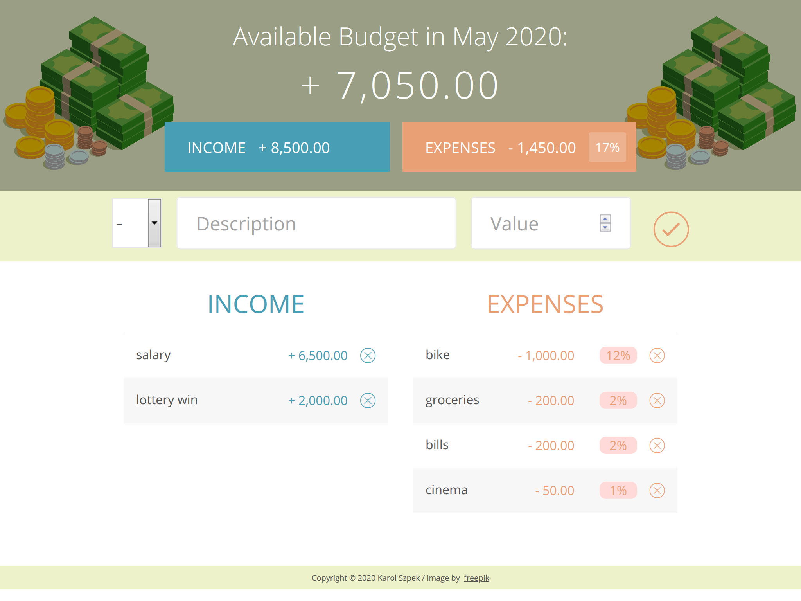
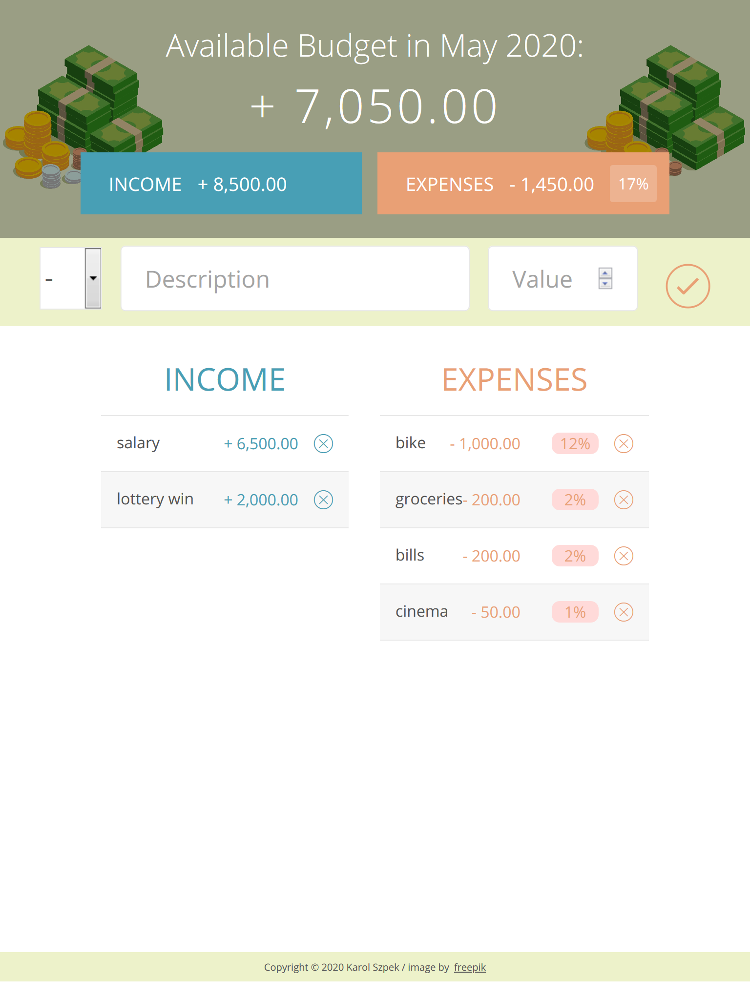

LIVE: https://karolsz15.github.io/budget/

Budget application written with javascript including following functionalities:

1. Adding incomes and expences with descriptions and values
2. Displaying lists of incomes and expenses 
3. Deleting chosen incomes or expenses from the lists
4. Displaying available budget and percentage of expenses in overall budget

SCREENSHOTS

1. Desktop view

2. Tablet - landscape mode

3. Tablet - portrait mode

4. Mobile phone - landscape mode

5. Mobile phone - portrait mode

